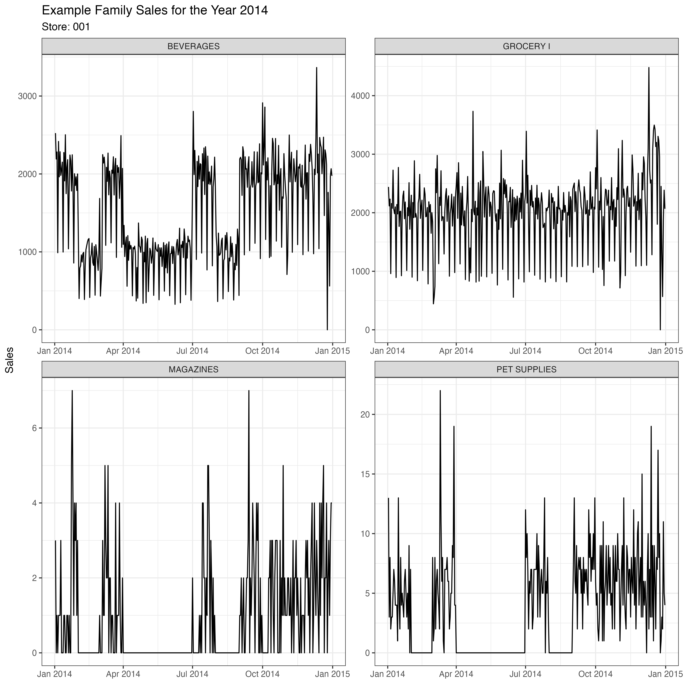
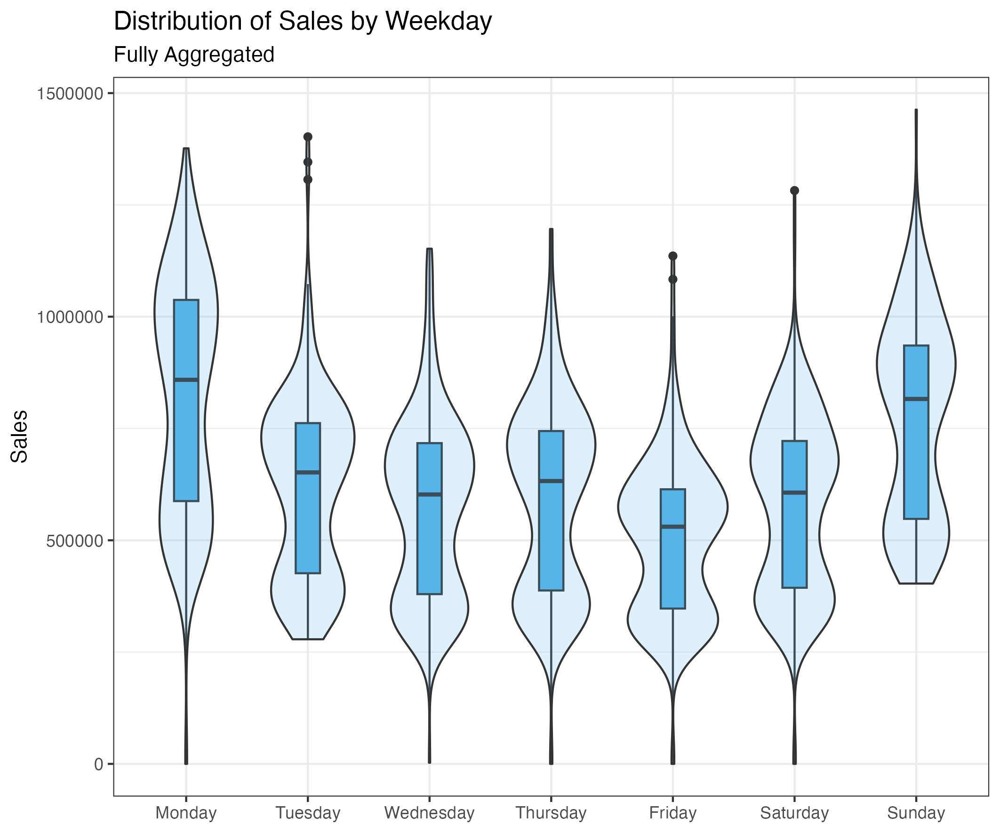
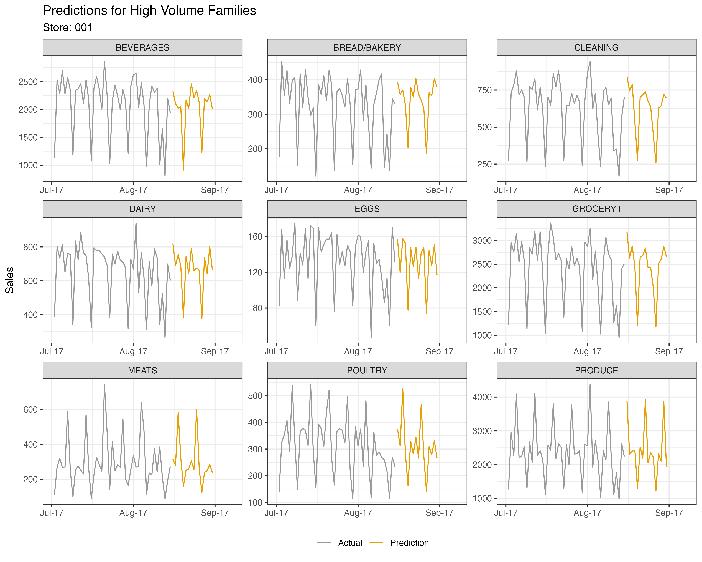

# Store Sales Forecast [R]

This repo contains the code for the Kaggle competition [Store Sales Time-Series Forecasting](https://www.kaggle.com/competitions/store-sales-time-series-forecasting/overview).

## Results 

The archieved score on Kaggle was `0.404033` based on the script `modelling_catboost.R` that contains clear defined formulas.

### Methodical Approach

The goal of the Kaggle competition was a daily sales forecast of all provided product families on store level for the next 16 days. For this a direct strategy based on different models was choosen. Moreover, a global modeling approach was used.

#### Global Modeling

In contrast to a forecast at a single level (e.g. sales of one store or family), there are many time-series on the family level that have histories of different lengths. There are different modeling approaches with which this aggregation level can be modeled. Here, the decision was made to use *global modeling*. In this way, it is possible to carry out modeling without the need to train a model for every single family for each store. With local modeling as it is normally implemented, the model specification is carried out separately for each time-series. On the other hand, with global modeling a model specification is made for *all* time-series within a given forecasting horizon. As demonstrated by [Montero-Manso & Hyndman (2020)](https://arxiv.org/abs/2008.00444), despite such a global model specification, similarly good results can be achieved as with local modeling. Detailed information regarding the global modeling approach may be found in the paper by [Montero-Manso & Hyndman (2020)](https://arxiv.org/abs/2008.00444) referenced above.

#### Data Preparation

Since the global model is based on a global model specification and the data preparation is essential for appropriate modeling, these steps will be presented in detail. Since the observed time-series have different scalings and volumes, yet are to be modeled together, the scaling must be aligned. Such harmonization of the scaling is necessary for all features that relate to the family-store specific volume. This is done by a standardizing each time-series based on the standard deviation and the mean:

$${x_{scaled} = \frac{x-x_{mean}}{x_{sd}}}$$

Because the predictions then have to be transformed back to their original scaling, the required parameters that were used for the standardization are saved for each store-family combination. Feature engineering now takes place based on the standardized data. After fitting the model the predictions will be rescaled with the parameters saved at the time of standardization.

#### CatBoost

CatBoost represents an algorithm based on gradient boosting and decision trees. Unlike other well-known algorithms, CatBoost has some advantages that other tree-based models do not have. First, CatBoost uses *ordered boosting*, a modified version of gradient boosting. This modification leads to better performance compared to other established algorithms such as *XGBoost* or *LightGBM*. Another advantage is the conversion of categorical features into a numeric format (siehe [catboost: Transforming categorical features to numerical features](https://catboost.ai/en/docs/concepts/algorithm-main-stages_cat-to-numberic)). This is done in an efficient manner and makes upstream processing of categorical features redundant. Various product information such as *store*, *month*, *weekday* and more are used here. If this information were not converted into a numerical format, each characteristic would lead to an additional column for modeling. In such a case, it would be a classic one-hot encoding. However, this would make the training significantly less efficient.

More information about the implementation used can be found on [catboost.ai](https://catboost.ai/en/docs/).

### Data





### Predictions

Below are sample forecasts for high volume families based on the store 001. 



## Setup

The dependencies are managed using [renv](https://rstudio.github.io/renv/articles/renv.html). 
To install the defined dependencies for this project, just run the following R code:

```r
# only if renv is not already installed
install.packages("renv")
renv::restore()
```

The package `catboost` is not tracked via `renv`. However, an installation of 
the used version `1.1.1` can be made with the following code:

```r
# Possible tgz files based on OS:
# Windows: catboost-R-Windows-1.1.1.tgz
# Linux: catboost-R-Linux-1.1.1.tgz
# macOS: catboost-R-Darwin-1.1.1.tgz
devtools::install_url(
  "https://github.com/catboost/catboost/releases/download/v1.1.1/catboost-R-Darwin-1.1.1.tgz",
  INSTALL_opts = c("--no-multiarch", "--no-test-load")
)
```

## Conventional Commits

`commit -m  "Tag MESSAGE"`

`commit -m "feat added linear regression to toolstack"`

| Type              | Content                         | 
| ----------------- | ---------------------------- | 
| fix               | Patches a bug in the codebase. | 
| feat              | Introduces a new feature to the codebase.  |
| test              | Adding missing tests or correcting existing tests. | 
| docs              | Adds, updates or revises documentation that is stored in the repository. | 
| ops               | Changes that affect operational components, like infrastructure, deployment, backup,  |
| refactor          | Refactoring existing code in the product, but without altering or changing existing behaviour in the product.  | 
| build             | Changes that affect build components or external dependencies, like build tool, ci pipeline, project version. | 
| perf              | Code changes that improves the performance or general execution time of the product but does not fundamentally change an existing feature.  |
| chore             | Includes a technical or preventative maintenance task that is necessary for managing the product or the repository, but it is not tied to any specific feature or user story e.g., modifying gitignore. | 
| style             | Changes, that do not affect the meaning of the code (white-spaces, formatting, missing semi-colons etc.)  | 
| revert            | Reverts one or more commits that were previously included in the product, but accidentally merged or serious issues were discovered that required their removal. |


## Folder Structure

```
├── 01_data
│   ├── intermediate              <- prepared data and other intermediate outputs
│   ├── raw                       <- provided raw data
│   └── results                   <- forecasting and evaluation results
├── 02_code                       <- R scripts
├── 03_figures                    <- relevant plots based on EDA and results
├── 04_reports                    <- RMarkdown reports for more details
├── R                             <- All defined R functions
├── README.md
├── renv                          <- contains renv related resources
├── renv.lock                     <- locked dependencies used for this project
└── store-sales-forecast-r.Rproj
```

The folder `01_data` is part of the `.gitignore` file. Therefore, you need to 
setup this folder by your own. You can download the needed data from the [Kaggle Competition](https://www.kaggle.com/competitions/store-sales-time-series-forecasting/overview).
